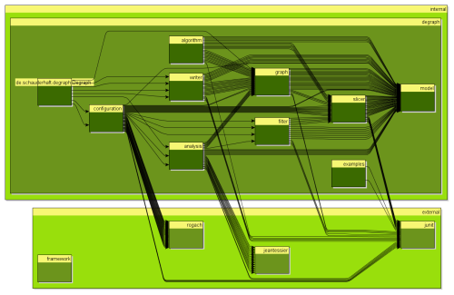
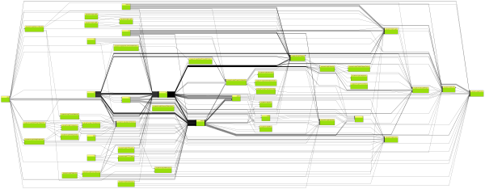
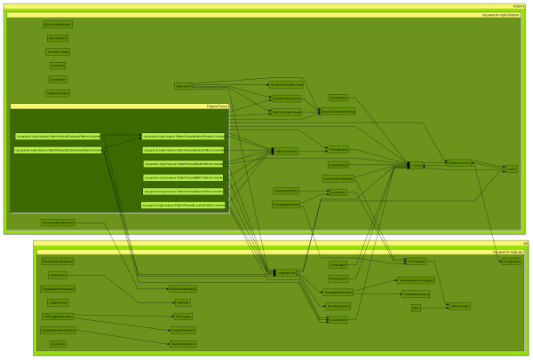

# Degraph Manual #

* auto-gen TOC:
{:toc}

## Introduction ##

Degraph is a tool for visualizing and controlling class and package dependencies in JVM applications.

There are two basic usages: You can **analyze classes and create a graphml file** which then can be rendered and interpreted using [yed, a free graph editor](http://yed.yworks.com).

Or you can **define constraints on the dependency** using an internal Scala DSL **and run tests** to prevent violations of your desired dependency structure.

What makes Degraph different from other similar tools is that it supports nested graphs. Inner classes are visualy contained in their containing class; Classes are contained inside packages and if you want you can group packages to modules, layers and so on. These ways of grouping classes are [referred to as slicings in Degraph](#nomenclature).

If you do a hierarchic layout in yed for the resulting graphml file you can easily see which classes you can move to different packages, layer or modules without creating circular dependencies or which you have to move in order to break cycles.

## Visualization of Dependencies ##

Visualization of Dependencies can be very helpfull when you try to understand the structure (or the absence of such structure) of dependencies in a project. Lets get started right away by analyzing Degraph and some of it's components itself.

### Getting Started ### 
The following images are created (and can be recreated by yourself) by 

* downloading degraph
* unzip into a directory ( _theDir_ )
* open a console and change into _theDir_/degraph/bin
* execute `degraph -f ../example/example#.config` with # replaced by one of the digits 1, 2 or 3
* open the resulting `example#.graphml` in yed, opening up some of the nodes and applying an hierarchic layout. 

Move your mouse over the images to see enlarged versions of the images

#### The structure of Degraph ####

##### Configuration File #####

The configuration file example1.config might look like this (details may vary with the version of Degraph)

    output = example1.graphml
    classpath = ../lib/degraph-{{site.current_version}}.jar
    exclude = java*.**
    exclude = scala.**
    exclude = org.scalatest.**
    part = {
        de.schauderhaft.*.(*).**
    }
    lib = {
    	de.schauderhaft.(*).**
    	*.(*).**
    }
    internalExternal = {
       internal de.schauderhaft.**
       external **
    }
		
Note that there are two simple excludes for filtering out scala and java core libraries, but other libraries show up in the diagram, although they are not part of the analyzed jar, but referenced from the jar.

Everything after the excludes is the configuration of slicings. See the [documentation of the configuration file format for details](#the_configuration_file_format).

##### Result #####

Degraph is rather boring to look at since it is rather small and also has a very clean package structure (after all it is a tool for managing package structure). So lets look at a more interesting example.

#### Overall structure of Log4J ####

Let's have a look at Log4J. Note that although we'll find stuff that I'd consider not clean, Log4J library is one of the most important little gems in the Java universe, and no matter how it looks in the inside, it does its job rather well, and that is the most important thing.

##### Configuration File #####

The configuration file looks like this.

    output = example2.graphml
    classpath = ../lib/log4j-1.2.16.jar
    include = org.apache.log4j.**
    part = {
        org.apache.log4j.(*).**
    }

It specifies the jar to analyze and only includes stuff from `log4j` itself. So we won't see any `java.lang` stuff it might depend on. Also the configuration consideres the first package part after `org.apache.log4j` as a *part*. This means it will create nodes on that level, containing all the classes in the respective packages and subpackages.
	
##### Result #####

As you can see the diagram is rather large. If the dependency structure would be cycle free, there would be only arrows going from left to right. But there are many arrows going from right to left, so we have circles. Actually in a current version of Degraph cycles would be colored red and this diagram would be rather colorfull.

Two parts seem to be very important: `helpers` and `spi` there are lots of arrows to and from those nodes. I'd be rather skeptical about a `helpers` package in itself, especially when it has so many dependencies, but look at the two package and their subpackages, by filtering out everything else. 

#### The spi and helpers packages of Log4J ####

##### Configuration File #####

This is basically the same configuration as before, just with the includes fine tuned to only include the `spi` and the `helper` package.

    output = example3.graphml
    classpath = ../lib/log4j-1.2.16.jar
    include = org.apache.log4j.spi.**
    include = org.apache.log4j.helpers.**
    part = {
        org.apache.log4j.(*).**
    }

##### Result #####

 

 
For this diagram I expanded all the nodes, to see the details of the cycle between the two packages. What are we looking at? The two outer light green boxes are the parts specified through the configuration file: `spi` and `helpers`. Contained in those parts is only a single package `org.apache.log4j.spi` and `org.apache.log4j.helpers`. Although there is a one to one relationship this doesn't have to be this way with other configurations. The packages nodes visually contain all the classes. There is one special case: the `PatternParser` class has inner classes so it becomes itself a group node containing the nodes for the inner classes.

As one might have guessed the helpers package contains all kinds of stuff. If we look at the dependencies between `spi` and `helpers` we note that all dependencies go from left to right, which is a good sign, because it makes it likely that it is rather easy to break this cycle. Note that we still have a cycle because the arrows are going up and down between the nodes. This is what I call the [Bypass Antipattern of Package Dependencies](http://blog.schauderhaft.de/2013/03/24/dependency-antipatterns-the-bypass/).

If we extract the classes for `helpers` that `spi` depends on into a seperate package we should be able to improve the situation. That would be the classes `LogLog` and `Loader`. But we have to take `OptionConverter` along for the ride, since it is entangled with the other two. Now we can immediatly see that `OptionConverter` depends  on `Configurator` which is again in the `spi` part, which would cause another cycle, so take it into the new package as well, and the result should have one cycle less. 

**This is the power of Degraph: that you can see all the dependencies of all classes in the packages you decided to look at. This enables you to easily identify classes that you can or should move.**

### The Configuration File Format ###

Except for very basic experiments you'll want to specify a configuration file using the **-f** command line argument. This section describes the format of the configuration file.

#### Example File ####
We'll go through the different parts of the configuration file by examining an example, which is also included in the distribution of Degraph 

    output = example1.graphml
    classpath = ../lib/degraph-0.0.4.jar
    exclude = java*.**
    exclude = scala.**
    exclude = org.scalatest.**
    part = {
        de.schauderhaft.*.(*).**
    }
    lib = {
    	de.schauderhaft.(*).**
    	*.(*).**
    }
    internalExternal = {
       internal de.schauderhaft.**
       external **
    }

#### Simple Properties ####

You can provide simple properties for the path to analyze, the name of the file to generate, classes to include or exclude using the syntax

    <property>=<value>

Available properties are:

* output - the file where the resulting graphml file will be created. Relative paths are relative to your current directory when you start degraph.
* classpath - this is the path to analyze. It is a list of files and directories seperated by the classpath separation character of your platform, i.e. `':'` on Unix and `';'` ond windows. Please make sure there is no space around the separators: "classpath=dir1;dir2". All class and jar files found in those directories or subdirectories will get picked up by Degraph.  
* exclude an Ant like pattern of class names to exclude from the analysis
* include an Ant like pattern of class names to include from the analysis. If not specified, all classes (minus any excludes) are inlcuded. There can be an arbitrary number of exclude and includes specified and the order does not matter. 

Each property has to stand on its own line.

#### Slicing ####

You can specify an arbitrary number of slicings through your code base. A slicing is a grouping of classes that in some sense belong to each other. Examples might be: 

* classes belonging to the same library, like _hibernate_, _log4j_ and so on.
* classes belonging to the same module, like _shoppingcart_, _authentication_, _fullfillment_.
* classes belonging to the same layer, like _UI_, _domain_, _persistence_, _restapi_
* classes belonging to your code vs. external stuff: _internal_, _external_

For each slicing you want to apply you add a section like this to the configuration:

    <slicinglabel> = {
	    <list of patterns>
    }

Note that the opening `{` has to be on the same line as the label and `=` sign while the closing `}`  has to be on its own line. Patterns come in two and a half flavors:

*Named patterns* look like this: 

    <name> <pattern>

Every class that is matched by the pattern is part of the slice given by the name. So a pattern of 

    mine de.schauderhaft.** 

will put all classes with a full qualified name starting with `de.schauderhaft.` in a slice named `mine`.

*Simple patterns* look like this:

    <pattern>

or 

    <prefix>(<naming part>)<suffix>

A class matched by this pattern will get added to the slice given by the full `<pattern>` (first case) or by the `<naming part>` in the second case. 

For example this pattern

    *.(*).** 

will put all classes from `org.junit.` in the slice `junit` and all the stuff from `org.hibernate.` in the slice `hibernate`.

All patterns in a slicing definition (i.e. between `{`and `}`) will get tried in order for each class until a match is found. That match defines the slice used for the class.

#### The pattern matching syntax ####

Pattern matching in the definition of slices uses an Ant like syntax for specifying full qualified class names. With `*` standing in for an arbitrary number (0-n) of arbitrary characters, but no dots. `**` matches and arbitrary number (0-n) of arbitrary characters, including dots.

### Working with yed ###

Degraph generates `.graphml` files that are intended to be rendered using [yed](http://yed.yworks.com). Yed is a general purpose graph editor with strong layout capabilities. Lots of its capabilities aren't needed when working with files from Degraph. So this article describes an efficient way to work with it.

I'll assume you have downloaded and installed yed. So go ahead and start it up.

I also assume you have a graphml file ready. If not, head over to the [getting started section](#visualization_of_dependencies) and learn how to create one.

#### Basic Layout ####

On startup you get various options what to do. Choose 'Open...' and select the graphml file you want to view.

You will probably see a single box. That's ok, don't worry. Degraph doesn't generate any layout information on its own, so all boxes are located at the same position, hiding behind each other. We'll change that in a second. 

Select the menu Layout -> Hierarchical ...

This opens a dialog. Select the following options and leave everything else as it is.

On the General tab

Orientation: Left to Right

On the Edges tab

Routing Style: Polyline

Click on the Dock button. This will put the dialog in the side bar.

Press the green triangle play button.

Voila, you should now see your graph nicely laid out.

#### Unfolding nodes ####

You are now seeing nodes representing slices (either custom slices configured in the configuration file or packages). You can unfold those slices by clicking on the little  + marker in the top left corner. After that you probably want to layout the graph again. That's why we docked the layout dialog. You just have to press the play button once more.
  
#### Overview ####

In the Overview (it's open by default) you can see a tiny version of the complete graph. If you zoom in, in the main window (for example using the scrollwheel) the overview will highlight the area you are looking at in the main view. You can drag that view port around using the mouse in the Overview, allowing you to quickly navigate even a large graph.

#### Neighborhood View ####

Yed offers a couple of context views. For our purpose the must useful one is the Neighborhood View. It might be already docked on the side of the screen. If not, open it up using the menu Windows -> Context Views -> Neighborhood View. You might want to increase it in size.

If you now click on a node or an edge it shows you the predecessor and successor nodes of whatever you selected. Very helpful if you try to prune dependencies from a class.

#### General Tips ####

No matter how sophisticated a layout algorithm is. A graph with 1000s of nodes and even more edges will look messy. In order to limit the size of graph you have to deal with use the following techniques:

* Collapse nodes which you don't care about in detail

* Remove collapsed nodes which you don't care about at all, this will also delete all contained nodes.

* When changing your code based on what you see in the graph, you'll probably want to look at the same nodes over and over again. Use filters in your configuration file to limit the nodes generated.

## Testing of Dependencies ##

When you decided what kind of dependencies you want to have in your project, and which you don't, you probably want to ensure that everybody involved sticks to these rules. Degraph will help you with that.

The basic idea is to define slices and based on those slice you define the dependencies that are allowed. 

The DSL for defining such criterias comes in two flavors: Scala and Java. The Scala version is the primary one and is a little more slick, but the Java DSL should be very usable and is very close to its Scala sister. You don't have to feel bad for using it. 

The DSL is in its early versions and might change significantly in future version once I find out what people are actually trying to do with it.
Let me know what you like or don't like and if you have ideas for improvements.

### Setting up the project ###

You can either download the full distribution zip of Degraph, unzip the downloaded files and add all the contained jars to your classpath.

Alternatively you can download the two relevant artefacts: the *core jar* and *check jar* along with their respective poms and put them in your Maven repository, where you can reference them from your project pom or gradle build file or ...

I start working on getting everything into maven central as soon as I have this documentation task of my hands. So lets get down to business

### Scala Constraints DSL ###

The Scala constraints DSL of Degraph is based on [ScalaTest](http://www.scalatest.org/) [matchers](http://www.scalatest.org/user_guide/using_matchers). 

#### No Circles ####

A good start is to check if your application contains dependency cycles. A complete test might look like this:

    import org.junit.runner.RunWith
    import org.scalatest.junit.JUnitRunner
    import org.scalatest.matchers.ShouldMatchers
    import org.scalatest.FunSuite
    import de.schauderhaft.degraph.check.Check._
        
    @RunWith(classOf[JUnitRunner])
    class DependencyTest extends FunSuite with ShouldMatchers {
    
        test("Degraph has no cycles") {
            classpath.including("de.schauderhaft.**") should be(violationFree)
        }
    }

The `RunWith` annotation is only needed so this ScalaTest test becomes a JUnit test. I like it that way, because it allows me to use the JUnit plugin of my IDE to execute the tests, but it is not essential.

Most of the rest is just a standard ScalaTest test. There are really just two interesting lines: 

    import de.schauderhaft.degraph.check.Check._

and	
	
    classpath.including("de.schauderhaft.**") should be(violationFree)

The import makes the Degraph DSL available. The second one is the actual test. 

`classpath` is a predefined `ConstraintBuilder` containing the current classpath as the path to get analyzed. 

`including` is a method which allows to define an include filter. Without specifying a filter, Degraph would analyze everything in your classpath. Since this most probably also includes all kinds of libraries, it is a really good idea to limit the result to your own stuff, as I did here.

`violationFree` is the actual matcher that checks all defined dependency constraints. But did we define any? Yes we did. By default every `ConstraintBuilder` contains the constraint that no cycles are allowed. To be more precise: Every [slice type](#slice_type) gets checked if it results in any cycles. If so these cycles will be considered a dependency violation.

But where did we define any slicing? Every configuration in Degraph contains an implicte Slicing consisting of the packages themself. I.e. the test above asserts, that the code is cycle free on package level. 

#### Adding Slicings ####

The default slicing '`package`' isn't satisfying. You probably want to define other slicings, e.g. layers of your application, or the different modules of your application or both. You can do that useing the `withSlicing` method and patterns as used in the [configuration for visualization](#Slicing). The first parameter of `withSlicing` is the name of the slicing. The following parameters are patterns in one of two forms, either as an unnamed pattern, these are simple Strings, or as a named pattern, i.e. a tuple of a pattern name and the actual pattern, like in the following examples.

    classpath.including("de.schauderhaft.**") //
	    .withSlicing("module", "de.schauderhaft.(*).**") // use the third part of the package name as the module name
        .withSlicing("layer", 
		    ("persistence","de.schauderhaft.legacy.db.**"), // consider everything in the package de.schauderhaft.legacy.db and subpackages as as part of the layer "persistence"
		    "de.schauderhaft.*.(*).**") // for everything else use the fourth part of the package name as 
		) 

#### Simple Constraints On Slicings ####

Thes following specifies that with the slicing 'part' the slice 'check' may depend on any of the slices 'configuration', 'graph' or 'model'. The slice 'configuration' may depend on any of 'graph' and 'model' but not on 'check' and so on. Or to put it differently: Dependencies from left to right are ok, from right to left aren't. This kind of constraint is usefull for slicings specifying business modules, where you want to enforce some ordering.

    classpath.withSlicing("module", "de.schauderhaft.degraph.(*).**") .allow("check", "configuration", "graph", "model")

`allow` allows dependencies between the given slices from left to right, but not from right to left.

Dependencies from and to classes not part of the specified slices ar not constraint.

#### Strict Constraints ####
 
If you don't want to allow dependencies to skip layers, you use `allowDirect` instead of `allow`. So the following allows 'check' to depend on 'configuration, but it disallows a dependency from 'check' to 'graph' or 'model' since that would skip 'configuration' 
 
    classpath
	    .withSlicing("module", "de.schauderhaft.degraph.(*).**")
		    .allowDirect("check", "configuration", "graph", "model")
 
Classes not part of the specified slices may depend on the first element in the list, and the last element in the list may depend on such unspecified classes.
 
#### Unspecified Order of Slices ####

If there is a group of slices for which you don't care about the order, you can specify them using `anyOf` like in the following example: 

    classpath
	    .withSlicing("module", "de.schauderhaft.degraph.(*).**")
	        .allow("check", anyOf( "configuration", "graph"), "model")
	
The meaning of this constraint is very similar to [the simple constraint above](##simple_constraints_on_slicings), with the exception that dependencies from 'configuration' to 'graph' are allowed just as the other way round. Of course the 'no cycles' constraint still applies so both directions of dependencies must not be present at the same time.

#### One of Many Slices ####

If you use for example a hexagonal architecture, you probably have something like a persistence and a gui layer both may access the domain layer, but must not access each other. A constraint as that can be expressed using the `oneOf` method

    classpath
	    .withSlicing("layer", "de.schauderhaft.app.*.(*).**")
	        .allow(oneOf( "persistence", "gui"), "domain")
			
The slices inside a `oneOf` group must not access each other but might get accessed by slices on the left and access slices on the right. Of course you can use `oneOf` inside `allow` as well as inside `allowDirect`.
	 
#### Excluding Jar Files ####

Include and exclude work on fully qualified class names. This means if you write the tests as described above all the 3rd party libs in your classpath will still get analyzed, just to be excluded from the dependency graph. But most of the time we just want to check our own code. If this is the case you can use `noJars`, which will exclude everything from the classpath, that does end on `.jar`. This should speed up many tests just fine.

#### Printing Graphml on Testfailures ####

If you have test failures you probably want to look at the problem using the visualization of Degraph. Until recently
you had to start the commandline tool for this,
including creating a configuration that matches you test. Beginning with release 0.1.1 you can add a call to 'printTo'
with a path as parameter. Like so

    classpath
        .printTo("degraphTestResult.graphml")
	    .withSlicing("layer", "de.schauderhaft.app.*.(*).**")
	        .allow(oneOf( "persistence", "gui"), "domain")

### Java Constraints DSL ###

If you haven't already, please go back and read the section about the Scala based DSL. It explains how the DSL works and is mostly applicable to the Java DSL as well. I'll wait here and explain the differences in the Java API when you are back.

*... time goes by ...*

#### Importing the DSL ####

The imports for the Java DSL look slightly different. On one hand you probably use Java, so the syntax is a little different, and you also need a little extra stuff, in order to make the API work in Java. So please add the following imports to your test class, apart from your usual JUnit imports:

    import de.schauderhaft.degraph.configuration.NamedPattern;
    import static de.schauderhaft.degraph.check.JCheck.*;
    import static de.schauderhaft.degraph.check.Check.classpath;
    import static de.schauderhaft.degraph.check.JLayer.*
    import static org.hamcrest.core.Is.*;
    
#### Differences in the Java DSL compared to the Scala version ####

`classpath` is a method (just as in Scala but there you can't tell the difference, at least not from its usage). Therefore you have to provide an empty parameter list.

    classpath().withSlicing("blah", "whatever");
	
The same is true for `noJars`

    classpath().noJars().withSlicing("blah", "whatever");
	
In order to define a named slice pattern you have to actuall instantiate a `NamedPattern`

    classpath().withSlicing(
			"mainVsTest",
			"de.schauderhaft.**(Test)",
			new NamedPattern("main", "de.schauderhaft.*.**"))

Since you probably use JUnit to write your tests, you won't be able to use the ScalaTest matchers (which is a bummer). So we'll use Hamcrest instead.

    assertThat(
		classpath()
				.including("de.schauderhaft.**")
				.withSlicing("part", "de.schauderhaft.*.(*).**"),
		is(violationFree()));
			
## Stuff ##
### Installation ###

For using Degraph you need a JDK 7 or higher properly installed. It might work with older versions but we never tried ... let us know if you try it.

Take the downloaded zip file and unzip it to a place you like. 

Done. You can now start Degraph by executing the degraph in the bin folder. If you want to  you can add degraph to your path to make executing it a little easier.

### FAQ ###

#### The resulting Graph is empty ####

Make sure you specify the correct path to the **class**-files. Source files don't work. Paths that don't contain class-files (nor jar files, containing class files) will be silently ignored. So a typo in the path specified easily results in a empty graphml file.

#### Analyzing my classes takes for ever / yed takes for ever to load or display my graphml file ####

Given a path Degraph analyzes everything that looks like a class file in that directory or in subdirectories, including jar files. So if you use the root directory of a large multi module project in standard maven layout, it will analyze all the class files of the project (test and main). If have jars in there, those will get analyzed as well.

Make sure you have only those classes / jars in the path given to Degraph, that you are really interested in. Make use of the filter options to limit the classes that actually end up in the graph.

### A little Theory ###

### Nomenclature ###

Degraph abstracts over some things which most of the time don't get abstract over. Therefore I had to come up with some names. This of course is somewhat confusing for people until they understand these name, so this page is here to help.

#### Node ####

A node is something displayed as a box by yed. It might represent a class, package or the intersection of slices of different slice type.

#### Simple Node  ####

A simple node is a node that doesn't have any further substructure. Currently simple nodes represent classes, but one day there might be simple nodes representing a bean in a spring configuration or similar things. 

#### Complex Node ####

A Complex Node is one which has content. There are two kinds of complex nodes: Slice Nodes (see below) and nodes representing classes with inner classes.

#### Slice ####

A slice is a collection of simple nodes. A slice has a slice type. All the classes in the package 'de.schauderhaft.degraph' might be a slice, with the slice type 'package'. All the classes in the package or subpackages of 'org.apache' might be part of the slice 'apache' of type 'lib'. What slices exist depends on the slicings defined in the configuration file. Note: slices are not slice nodes these are different things although the difference is maybe a little hard to grasp. See below for details

#### Slice Type ####

A slice type is a categorization of slices. It can be considered the name of a slicing. All slices with the same type are disjunct, i.e. no simple node is in more than one slice of the same slice type.

#### Slicing ####

The way how all the simple nodes gets distributed into a set of slices which all have the same slice type. This is what you define in a configuration file with something like 

    lib {
        org.(*).**
        (*.*).**
    }

This says: I define the slicing of type 'lib' such that everything starting with 'org.' ends up in the slice given by the second part of the package name. Everything else ends up in the slice given by the first two parts of the package name.

There is one implicit slicing: the one defined by packages.

#### Slice Node ####

a slice node is a node representing a set of slices with mutual distinct type. Ok, take a deep breath. This is going to be a little tricky. 

You might think a Slice Node is the same as a Slice, or just the visual representation of a Slice. But there is a little but important difference. Lets imagine a tiny project with two classes: 

`de.schauderhaft.Example` and `de.schauderhaft.ExampleTest`

Lets work with two slicings: 

1. The default package slicing, which puts each class in its package. 

2. A *deployUnit* slicing which puts everything containing the String 'Test' in the slice 'Test' and everything else in the slice 'Main'

So we have three slices: `deployUnit:Test`, `deployUnit:Main`, `package:de.schauderhaft`

But if you look at it in yed you'll see:

`Test`, `de.schauderhaft in Test`, `Main` and `de.schauderhaft in Main` these are *Slice Nodes*. The important part is that the slice `de.schauderhaft` got duplicated because it contains classes that according to another slicing belong to two different slices.

Note 1: For slicings other then the package slicing you can control the order by which they get applied by the order in which they appear in the configuration file.

Note 2: Conceptually 'a in b' is considered the same Slice Node as 'b in a'  

## Ressources ##

### Feedback ###
If you have a problem using Degraph, a question, a bug or an idea: Go ahead and create an issue at [Degraphs issue tracker](https://github.com/schauder/degraph/issues?state=open).

### Sources ###
You can find the source code to [Degraph at github](https://github.com/schauder/degraph).

### Keep Up To Date ### 

Want to be kept updated about news about Degraph? Consider subscribing to the [blog of the author](http://blog.schauderhaft.de), or keep an eye on the [homepage of Degraph](http://schauder.github.io/degraph/).

Don't want to miss the next release? Follow the [author on twitter](http://www.twitter.com/jensschauder).
